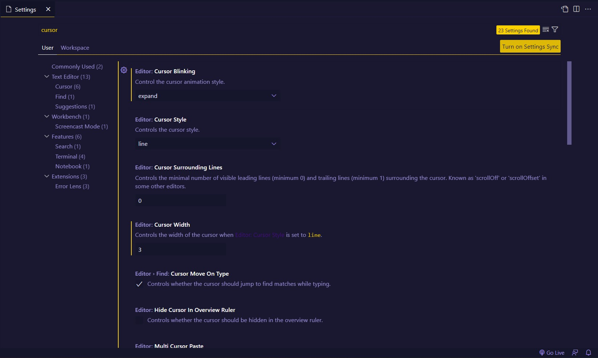
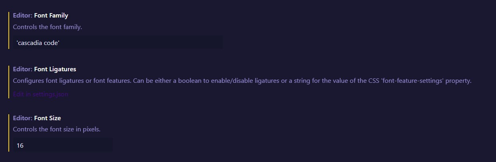

# My VSCode Settings

# Settings

This is my vscode settings for Font and Cursor :  
  
Search for **"Cursor"** in VSCode settings and set this for cursor animations:

for Font i'm using **"Cascadia Code"** Font Family <a href="https://github.com/microsoft/cascadia-code" target="_blank">Download From Here</a> with 16px Size.

# Extensions List & Usage

Here is the list of Extensions i'm using these days (I will update this post if I change my Extensions) :

1. <a href="https://github.com/prettier/prettier-vscode" target="_blank">Prettier :</a> Prettier  (extension for Visual Studio Code).

2. <a href="https://github.com/usernamehw/vscode-error-lens" target="_blank">Error Lens :</a> Improve highlighting of errors, warnings and other language diagnostics.

3. <a href="https://github.com/solnurkarim/HTML-to-CSS-autocompletion" target="_blank">HTML To CSS Autocompletion :</a> Provides completion suggestions for classes and ids from markup documents to stylesheets.

4. <a href="https://github.com/vscode-icons/vscode-icons" target="_blank">VSCode Icons :</a> Icons for Visual Studio Code (files icons).

## My Live Code Result Extensions

1. <a href="https://github.com/ritwickdey/vscode-live-server" target="_blank">Live Server :</a> Launch a development local Server with live reload feature for static & dynamic pages.

## My Themes Extensions

I'm using <a href="https://github.com/hikarin522/GlassIt-VSC" target="_blank">Glassit-VSC</a> Extension to set window to transparent with all of my themes.

Here is my themes list :

1. <a href="https://github.com/ayu-theme/vscode-ayu" target="_blank">Ayu Theme</a>
2. <a href="https://github.com/ankitmlive/firefly-theme" target="_blank">Firefly Theme</a>
3. <a href="https://github.com/guilhermerodz/omni-owl" target="_blank">Omini Owl Theme</a>
4. <a href="https://github.com/barrsan/reui-vscode-theme" target="_blank">Reui Theme</a>
5. <a href="https://github.com/ahmadawais/shades-of-purple-vscode" target="_blank">Shades of Purple Theme</a>
